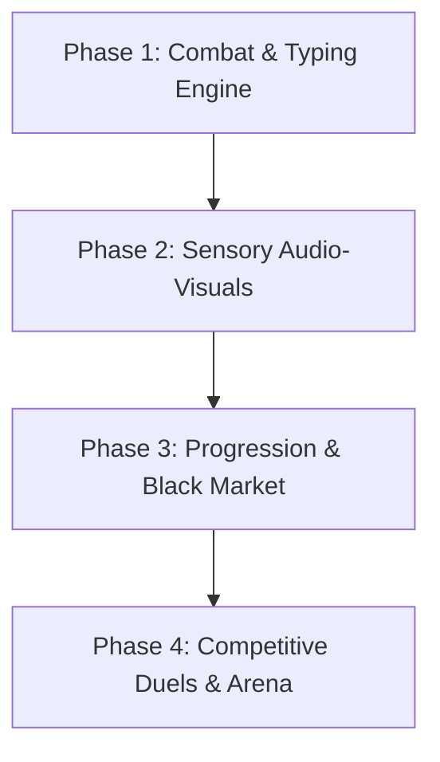

# SPEEDTYPE ROADMAP & EXECUTION WAVES

## Architectural Overview
SpeedType is architected as an ultra-responsive, zero-latency browser combat typing game.
The stack employs Vite + React + TypeScript + Tailwind CSS + HTML5 Canvas + Web Audio API (procedural synthesis, zero audio file downloads).

---

## Phases & Execution Waves

### Phase 1: Core Combat & Moment-to-Moment Action
- **Plan 1.1 (Wave 1)**: Core Typing Engine, Dynamic Word Dictionaries & Stance Triangle (Strike, Counter, Disrupt).
- **Plan 1.2 (Wave 2)**: Tug-of-War Kinetic Beam Physics, Overclock State (30 clean streak), and Finisher Word Duel Execution.

### Phase 2: Sensory Design & OLED Terminal Glitch Aesthetic
- **Plan 2.1 (Wave 1)**: OLED Terminal Layout, CRT Curvature / Scanline Shaders & Reactive Phosphor Glow Palettes.
- **Plan 2.2 (Wave 2)**: Web Audio Procedural Mechanical Soundstages (Thocks, Model M, Blips, Pitch scaling) & Canvas ASCII Impact Debris Physics.

### Phase 3: Progression, Economy & Cosmetic Flexes
- **Plan 3.1 (Wave 1)**: Kinetic Points (KP) Scoring Formula, State Persistence & The Black Market Storefront.
- **Plan 3.2 (Wave 2)**: Custom Typing Trails (Matrix Rain, Lightning Arcs, Neon Ghost) & ASCII KO Signatures.

### Phase 4: Competitive Ladders & Social Arena
- **Plan 4.1 (Wave 1)**: Microsecond Ghost Keystroke Recorder, Ghost Playback Engine (Bots + Replays) & Rivalry Dossier Nemesis Words Tracker.
- **Plan 4.2 (Wave 2)**: Tournament Lounge & Spectator Pit (4-8 players), Shard Wagering, Live ASCII Reaction Bar & Weekly Themed Trials (Code Syntax, Blind Duel, 1 HP).

---

## Phase Dependencies

