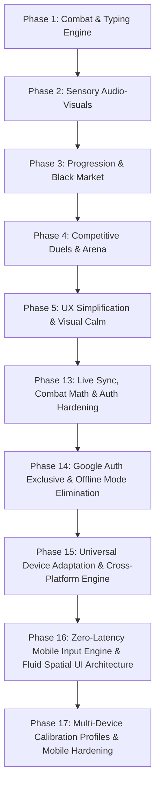

# SPEEDTYPE ROADMAP & EXECUTION WAVES

## Architectural Overview
SpeedType is architected as an ultra-responsive, zero-latency browser combat typing game.
The stack employs Vite + React + TypeScript + Tailwind CSS + HTML5 Canvas + Web Audio API (procedural synthesis, zero audio file downloads).

---

## Phases & Execution Waves

### Phase 1: Core Combat & Moment-to-Moment Action
- **Plan 1.1 (Wave 1)**: Core Typing Engine, Dynamic Word Dictionaries & Stance Triangle (Strike, Counter, Disrupt).
- **Plan 1.2 (Wave 2)**: Tug-of-War Kinetic Beam Physics, Overclock State (30 clean streak), and Finisher Word Duel Execution.

### Phase 2: Sensory Design & OLED Terminal Glitch Aesthetic
- **Plan 2.1 (Wave 1)**: OLED Terminal Layout, CRT Curvature / Scanline Shaders & Reactive Phosphor Glow Palettes.
- **Plan 2.2 (Wave 2)**: Web Audio Procedural Mechanical Soundstages (Thocks, Model M, Blips, Pitch scaling) & Canvas ASCII Impact Debris Physics.

### Phase 3: Progression, Economy & Cosmetic Flexes
- **Plan 3.1 (Wave 1)**: Kinetic Points (KP) Scoring Formula, State Persistence & The Black Market Storefront.
- **Plan 3.2 (Wave 2)**: Custom Typing Trails (Matrix Rain, Lightning Arcs, Neon Ghost) & ASCII KO Signatures.

### Phase 4: Competitive Ladders & Social Arena
- **Plan 4.1 (Wave 1)**: Microsecond Ghost Keystroke Recorder, Ghost Playback Engine (Bots + Replays) & Rivalry Dossier Nemesis Words Tracker.
- **Plan 4.2 (Wave 2)**: Tournament Lounge & Spectator Pit (4-8 players), Shard Wagering, Live ASCII Reaction Bar & Weekly Themed Trials (Code Syntax, Blind Duel, 1 HP).

### Phase 5: UX Simplification & Visual Calm
- **Plan 5.1 (Wave 1)**: App.tsx extraction (useMatchSession hook) & Navigation collapse (single [MENU] panel replacing 7-button header).
- **Plan 5.2 (Wave 1)**: CombatHud minimal redesign (remove live stats) & KineticBeam number removal (bar-only display).
- **Plan 5.3 (Wave 2)**: CSS animation calm-down (glitch timing, reduced-motion support) & asymmetric word zone (hero player card vs slim opponent strip).
- **Plan 5.4 (Wave 2)**: Idle screen 3-mode card selector & gray token hierarchy documentation.
- **Plan 5.5 (Wave 3)**: Modern Web Design Layer — physics-based spring easings, @starting-style modal animations, View Transitions API KO screen, CSS noise texture, JetBrains Mono, focus-visible system, sibling-index() stagger.

### Phase 13: Live Synchronization, Rigorous Combat Calculations & Hardened Authentication
- **Plan 13.1 (Wave 1)**: WPM Math Normalization & Rival AI Pacing Engine (keystroke WPM, symmetric variance, drift-free timestamp scheduler).
- **Plan 13.2 (Wave 1)**: Database Reset, Schema Verification & Auth Hardening (clean reset SQL, storage purge utility, Google OAuth reliability & guest fallback).
- **Plan 13.3 (Wave 2)**: Live Realtime Synchronization Without Webpage Refresh (reactive 1v1 challenge detection, realtime leaderboard sync, connected result actions).
- **Plan 13.4 (Wave 2)**: Marketplace Theme Auto-Equip & Connected UX Flows (auto-equip purchased themes, popup palette selector, connected gameplay loops).

### Phase 14: Google Auth Exclusive & Offline Mode Elimination
- **Plan 14.1 (Wave 1)**: Eradicate Offline / Guest / Local Modes & Dead Code (delete ProfileSetupModal, useProfile, local profile CRUD, purge local accounts).
- **Plan 14.2 (Wave 2)**: Google OAuth Popup Handshake & Account Selection (skipBrowserRedirect, centered popup, prompt: 'select_account', cross-window sync).
- **Plan 14.3 (Wave 3)**: Post-Authentication Pilot Handle & Avatar Setup Gate (verified Google gate, prompt handle/avatar only after authentication, Supabase persistence).

### Phase 15: Universal Device Adaptation & Cross-Platform Engine
- **Plan 15.1 (Wave 1)**: Anti-Spoof Hardware & Device Probing Engine (WebGL GPU, touch points, pointer queries, iPadOS unmasking, DeviceBadge & telemetry popover).
- **Plan 15.2 (Wave 2)**: Universal Adaptive Input Engine & Virtual Keyboard Architecture (AdaptiveInputCapture, VirtualKeyboardDock, physical vs mobile IME normalization).
- **Plan 15.3 (Wave 3)**: VisualViewport Dynamics, Safe Areas & Fluid Responsive Arena Layout (visualViewport height sync, responsive hero word scaling, safe-area insets).
- **Plan 15.4 (Wave 4)**: Cross-Device Modal Adaptations & Automated Verification Suite (mobile modal touch ergonomics, device detection unit tests, zero regression validation).

### Phase 16: Zero-Latency Mobile Input Engine & Fluid Spatial UI Architecture
- **Plan 16.1 (Wave 1)**: Zero-Latency Mobile Input Engine & Virtual Keyboard Pipeline (cancelable beforeinput, microtask tick deduplication, remove 30ms throttle, eradicate cursor flicker).
- **Plan 16.2 (Wave 2)**: Spatial Elegance & Uncluttered Fluid Mobile Layout (eradicate duplicate active word bar, minimalist top race beam, fluid hero word breathing room).
- **Plan 16.3 (Wave 3)**: Calibration Polish & Automated Input Validation Suite (TypingTest mobile spacing, rapid-fire double-letter test suite, full test runner integration).

### Phase 17: Multi-Device Calibration Profiles & Mobile Hardening
- **Plan 17.1 (Wave 1)**: Multi-Device Calibration Storage, Anti-Mismatch Gate & Device Profile Mapping (per-device calibration map, hardware profile verification, mismatch alert banner).
- **Plan 17.2 (Wave 2)**: Zero-Lag Controlled Buffer Input Pipeline & Rapid IME Synchronization (controlled value buffer diffing, WebKit QuickType IPC harmonization, touch focus lock).
- **Plan 17.3 (Wave 3)**: Mobile Viewport Anti-Cutoff Geometry, Safe-Area Anchoring & Automated Verification (window scroll lock to 0,0, short-viewport auto-scaling, multi-device test suite).

---

## Phase Dependencies

